# 嘉法狮网站后台管理系统 — 架构规划文档

> 基于 gattefosse.com 英文总站完整功能标准设计
> 文档生成日期: 2026-06-24

---

## 一、技术选型

| 层级 | 技术 | 版本 | 理由 |
|------|------|------|------|
| **后端运行时** | Node.js | 22 LTS | 与前端统一语言栈，降低团队维护成本 |
| **后端框架** | Express | 4.x | 成熟稳定，生态丰富，适合 REST API |
| **语言** | TypeScript | 5.x | 类型安全，减少运行时错误 |
| **ORM** | Prisma | 6.x | 类型安全的数据库操作，自动生成 migration |
| **数据库** | PostgreSQL | 16 | JSONB 原生支持标签数组，全文搜索，ACID 事务 |
| **缓存** | Redis | 7.x | JWT 黑名单、Session、API 限流 |
| **认证** | JWT + bcrypt | — | 无状态认证，配合 SAML 2.0 支持企业 SSO |
| **文件存储** | 本地磁盘 + Multer | — | PDF 和图片存储，预留 S3/OSS 接口 |
| **管理后台** | React 18 + Ant Design Pro | 6.x | 企业级后台 UI，中文生态最佳 |
| **构建工具** | Vite | 6.x | 开发体验好，HMR 快速 |
| **API 文档** | Swagger (swagger-jsdoc) | — | 自动生成，开发联调方便 |

---

## 二、项目目录结构

```
gattefosse-platform/
├── backend/                          # 后端服务
│   ├── src/
│   │   ├── index.ts                  # 应用入口
│   │   ├── config/
│   │   │   └── index.ts              # 环境变量、数据库、Redis 配置
│   │   ├── routes/
│   │   │   ├── auth.routes.ts        # 登录/注册/SSO
│   │   │   ├── ingredient.routes.ts  # 个人护理原料 CRUD
│   │   │   ├── pharma.routes.ts      # 药用辅料 CRUD
│   │   │   ├── formulation.routes.ts # 配方管理
│   │   │   ├── document.routes.ts    # 文档/文件管理
│   │   │   ├── news.routes.ts        # 新闻/活动
│   │   │   ├── user.routes.ts        # 用户管理(管理端)
│   │   │   ├── order.routes.ts       # 样品订单
│   │   │   └── content.routes.ts     # 静态内容/站点设置
│   │   ├── controllers/              # 路由对应的处理函数
│   │   │   └── ... (与 routes 一一对应)
│   │   ├── services/                 # 业务逻辑层
│   │   │   └── ... (与 controllers 一一对应)
│   │   ├── middleware/
│   │   │   ├── auth.ts              # JWT 验证中间件
│   │   │   ├── role.ts              # 角色权限校验
│   │   │   ├── upload.ts            # 文件上传 (Multer)
│   │   │   └── validator.ts         # 请求参数校验 (Zod)
│   │   ├── utils/
│   │   │   ├── jwt.ts               # JWT 签发/验证
│   │   │   ├── hash.ts              # bcrypt 哈希
│   │   │   └── response.ts          # 统一响应格式
│   │   └── types/
│   │       └── index.ts             # 全局 TypeScript 类型定义
│   ├── prisma/
│   │   ├── schema.prisma            # 数据库模型定义
│   │   └── seed.ts                  # 初始数据填充(标签字典等)
│   ├── uploads/                     # 文件存储目录 (gitignore)
│   ├── package.json
│   └── tsconfig.json
│
├── admin/                           # 管理后台前端
│   ├── src/
│   │   ├── pages/
│   │   │   ├── Dashboard/           # 首页仪表盘
│   │   │   ├── Ingredients/         # 个人护理原料管理
│   │   │   ├── Pharma/              # 药用辅料管理
│   │   │   ├── Formulations/        # 配方管理
│   │   │   ├── Documents/           # 文档管理
│   │   │   ├── News/                # 新闻/活动管理
│   │   │   ├── Users/               # 用户管理
│   │   │   ├── Orders/              # 样品订单管理
│   │   │   ├── Content/             # 站点内容设置
│   │   │   └── Settings/            # 系统设置
│   │   ├── services/
│   │   │   └── api.ts               # axios 统一封装
│   │   ├── components/              # 公共组件(富文本编辑器、图片上传等)
│   │   └── utils/
│   ├── package.json
│   └── vite.config.ts
│
├── site/                            # 对外展示站点 (现有前端)
│   └── ... (90+ HTML 页面, 通过 API 获取动态数据)
│
└── docker-compose.yml               # PostgreSQL + Redis 容器
```

---

## 三、数据库设计 — 完整 ERD

```mermaid
erDiagram
    pc_ingredients {
        int id PK
        string name "商品名 e.g. Emulium Mellifera MB"
        string inci_name "INCI名称"
        text description "产品描述"
        string dosage "推荐用量 e.g. 2-4%"
        string image_url "产品图片"
        string[] functionality_tag "功能: Actives/Emulsifier/..."
        string[] application_tag "应用: Face/Body/Hair/..."
        string[] concept_tag "概念: Upcycling/Wax butter/..."
        string[] claim_tag "宣称: Anti-aging/Moisturizing/..."
        string[] characteristic_tag "特性: PEG-free/Vegan/..."
        string[] naturality_label "认证: COSMOS/ERI360/RSPO/..."
        text composition_html "成分组成 富文本"
        text sensory_html "感官评估 富文本"
        text clinical_html "临床评估 富文本"
        int sort_order "排序"
        boolean is_published "发布状态"
        int created_by FK
        datetime created_at
        datetime updated_at
    }

    pharma_products {
        int id PK
        string name "产品名称"
        string slug "URL slug"
        text description "产品描述"
        string image_url "产品图片"
        string[] market_tag "市场: Human/Animal/Supplements"
        string[] route_tag "给药途径: Oral/Topical/..."
        string[] functionality_tag "功能: 19个选项"
        string[] dosage_form_tag "剂型: 20个选项"
        text composition_html "成分组成 富文本"
        text application_html "应用领域 富文本"
        text regulatory_html "法规支持 富文本"
        int sort_order "排序"
        boolean is_published "发布状态"
        int created_by FK
        datetime created_at
        datetime updated_at
    }

    formulations {
        int id PK
        string name "配方名称 e.g. Alien Slime"
        string code "配方编号 e.g. 2614-3.01"
        text description "配方描述"
        string image_url "配方成品图"
        string pdf_path "配方PDF路径"
        string[] application_tag "应用: Face/Body/Hair/..."
        string[] form_tag "剂型: Cream/Serum/Gel/..."
        string[] claim_tag "宣称: 30+选项"
        string naturality_index "天然指数: >99/>98/>95/>90"
        text composition_text "配方成分+比例"
        text preparation_steps "制备步骤"
        int sort_order "排序"
        boolean is_published "发布状态"
        int created_by FK
        datetime created_at
        datetime updated_at
    }

    formulation_ingredients {
        int id PK
        int formulation_id FK
        int ingredient_id FK
        string percentage "用量百分比"
    }

    documents {
        int id PK
        string title "文档标题"
        string type "类型: TDS/SDS/Brochure/Formula/Other"
        string file_path "文件路径"
        long file_size "文件大小 (bytes)"
        string language "语言: zh/en/fr"
        boolean is_public "是否需要登录"
        int download_count "下载次数"
        int created_by FK
        datetime created_at
    }

    doc_products {
        int id PK
        int document_id FK
        int product_id FK
        string product_type "关联类型: pc/pharma"
    }

    doc_formulations {
        int id PK
        int document_id FK
        int formulation_id FK
    }

    news_events {
        int id PK
        string type "类型: news / event"
        string category "分类: corporate/pc/pharma"
        string title "标题"
        string slug "URL slug"
        text summary "摘要"
        text content_html "正文内容"
        string image_url "封面图"
        int reading_time "阅读时长 (分钟)"
        date published_date "发布日期"
        date event_end_date "活动结束日 (events专用)"
        string location "地点 (events专用)"
        string booth "展位号 (events专用)"
        boolean is_published "发布状态"
        int created_by FK
        datetime created_at
    }

    news_tags {
        int id PK
        int news_id FK
        string tag_name "标签名 e.g. Sustainability"
    }

    users {
        int id PK
        string email UK "邮箱"
        string password_hash "密码哈希"
        string full_name "姓名"
        string company "公司名"
        string industry "行业"
        string job_function "职能"
        string phone "电话"
        string role "角色: super_admin / editor / user"
        string status "状态: pending / active / disabled"
        boolean saml_enabled "是否启用SAML"
        string saml_idp "SAML IdP标识"
        datetime last_login
        datetime created_at
    }

    user_favorites {
        int id PK
        int user_id FK
        string item_type "收藏类型: pc_ingredient/pharma/formulation"
        int item_id "收藏项目ID"
        datetime created_at
    }

    sample_orders {
        int id PK
        int user_id FK
        string order_number UK "订单编号"
        string status "状态: draft/submitted/processing/shipped/completed/cancelled"
        string company_name "公司名称"
        string contact_name "联系人"
        string email "联系邮箱"
        string phone "联系电话"
        string address "收货地址"
        text notes "备注"
        datetime submitted_at "提交时间"
        datetime created_at
        datetime updated_at
    }

    sample_order_items {
        int id PK
        int order_id FK
        string product_type "产品类型: pc_ingredient/pharma"
        int product_id "产品ID"
        int quantity "数量"
    }

    subsidiaries {
        int id PK
        string name "分公司名称"
        string country "国家"
        string city "城市"
        string address "地址"
        string phone "电话"
        string email "邮箱"
        string website "网站"
        string image_url "图片"
        string description "描述"
        int sort_order "排序"
    }

    page_contents {
        int id PK
        string page_key UK "页面标识: about/history/expertise_1~7/csr/..."
        string title "页面标题"
        text content_html "页面内容 富文本"
        string meta_title "SEO标题"
        string meta_description "SEO描述"
        datetime updated_at
    }

    settings {
        int id PK
        string key UK "设置项 key"
        string value "设置项 value"
        datetime updated_at
    }

    %% 关系定义
    pc_ingredients ||--o{ formulation_ingredients : "用于配方"
    formulations ||--o{ formulation_ingredients : "包含原料"
    formulations ||--o{ doc_formulations : "关联文档"
    documents ||--o{ doc_formulations : "配方PDF"
    documents ||--o{ doc_products : "产品文档"
    users ||--o{ user_favorites : "收藏"
    users ||--o{ sample_orders : "申请样品"
    sample_orders ||--o{ sample_order_items : "订单明细"
    users ||--o{ pc_ingredients : "创建"
    users ||--o{ pharma_products : "创建"
    users ||--o{ formulations : "创建"
    users ||--o{ news_events : "创建"
```



---

## 四、种子数据：筛选维度标签字典

以下标签列表作为数据库种子数据 (seed.ts)，注入到 PostgreSQL，管理后台用下拉多选组件来给产品打标签：

### 个人护理原料标签

| 维度 | 值列表 (JSON 数组格式) |
|------|---------------------|
| `functionality_tag` | `["Actives","Efficacy booster","Emollient","O/W emulsifier","Plant/Fruit extracts","Solubilizer","Texturizing agent","W/O emulsifier","Wetting agent"]` |
| `application_tag` | `["Baby & Child care","Body care","Eye care","Face care","Hair & scalp care","Make-up","Men's care","Sun care"]` |
| `concept_tag` | `["Gourmand ingredients","Inflamm'Aging","Local sourcing / France","NaDES/LTTM solvents","Plant from traditional medicine","Reunion island origin","Skin health and longevity","Upcycling & zero-waste","Wax butter technology"]` |
| `claim_tag` | `["Anti-acne","Anti-aging","Anti-dark circles and eye bags","Anti-oxidative","Anti-pollution","Anti-sagging","Anti-spots","Anti-wrinkles","Apaisant","Cell renewal","Cooling","Energizing","Firming","Hair discipline","Mattifying","Microbiome-friendly","Minimalist","Moisturizing","Photo-aging","Purifying","Repairing","Sebum control","Skin radiance","Smoothing","Soothing"]` |
| `characteristic_tag` | `["China compliant (IECIC)","Cold-processable","PEG-free","Preservative free","Readily biodegradable","Vegan"]` |
| `naturality_label` | `["COSMOS Approved","COSMOS Certified","ERI 360 Bronze","ERI 360 Silver","NOI = 100% (ISO 16128)","NOI > 99% (ISO 16128)","RSPO Mass balance"]` |

### 药用辅料标签

| 维度 | 值列表 |
|------|--------|
| `market_tag` | `["Human health","Animal health","Dietary supplements"]` |
| `route_tag` | `["Oral","Parenteral (veterinary)","Rectal","Topical/Transdermal","Vaginal"]` |
| `functionality_tag` | `["API Protection","Bioenhancer","Co-emulsifier","Co-surfactant","Emulsifier","Hard fat","Lubricant","Lymphatic promoter","Oily vehicle","Permeation enhancer","Self emulsifying drug delivery system","Skin penetration enhancer","Solubilizer","Solvent","Stabilizing agent","Surfactant","Sustained release","Taste masking","Thickener"]` |
| `dosage_form_tag` | `["Bi-gel","Cream","Emulgel","Foam","Gel","Granule","Hard capsule","Lotion","Microemulsion","Ointment","Patch","Pessary","Pour-on / Spot-on","Powder","Soft capsule","Solution","Stick","Suppository","Suspension","Tablet"]` |

---

## 五、API 接口设计

### 统一响应格式

```json
{
  "code": 0,
  "message": "success",
  "data": {}
}
```

### 5.1 认证模块 `/api/auth`

| 方法 | 路径 | 说明 | 权限 |
|------|------|------|------|
| POST | `/api/auth/login` | 邮箱密码登录 | public |
| POST | `/api/auth/register` | 用户注册 | public |
| POST | `/api/auth/saml/login` | SAML SSO 登录 | public |
| POST | `/api/auth/refresh` | 刷新 token | 已登录 |
| POST | `/api/auth/logout` | 退出登录 | 已登录 |
| GET | `/api/auth/me` | 获取当前用户信息 | 已登录 |

### 5.2 个人护理原料 `/api/ingredients`

| 方法 | 路径 | 说明 | 权限 |
|------|------|------|------|
| GET | `/api/ingredients` | 列表 (支持筛选/分页/搜索) | public |
| GET | `/api/ingredients/:id` | 详情 (含关联文档和配方) | public |
| POST | `/api/ingredients` | 创建 | admin / editor |
| PUT | `/api/ingredients/:id` | 更新 | admin / editor |
| DELETE | `/api/ingredients/:id` | 删除 | admin |
| GET | `/api/ingredients/tags` | 获取所有标签选项 | public |

> 筛选参数示例: `?functionality=Emulsifier&application=Face+care&naturality=COSMOS+Approved&search=Emulium&page=1&limit=20`

### 5.3 药用辅料 `/api/pharma`

| 方法 | 路径 | 说明 | 权限 |
|------|------|------|------|
| GET | `/api/pharma` | 列表 (支持筛选) | public |
| GET | `/api/pharma/:id` | 详情 | public |
| POST | `/api/pharma` | 创建 | admin / editor |
| PUT | `/api/pharma/:id` | 更新 | admin / editor |
| DELETE | `/api/pharma/:id` | 删除 | admin |

### 5.4 配方管理 `/api/formulations`

| 方法 | 路径 | 说明 | 权限 |
|------|------|------|------|
| GET | `/api/formulations` | 列表 | public |
| GET | `/api/formulations/:id` | 详情 (含成分表) | public |
| POST | `/api/formulations` | 创建 | admin / editor |
| PUT | `/api/formulations/:id` | 更新 | admin / editor |
| DELETE | `/api/formulations/:id` | 删除 | admin |
| POST | `/api/formulations/:id/ingredients` | 添加配方成分 | admin / editor |
| DELETE | `/api/formulations/:id/ingredients/:linkId` | 移除成分关联 | admin / editor |

### 5.5 文档管理 `/api/documents`

| 方法 | 路径 | 说明 | 权限 |
|------|------|------|------|
| GET | `/api/documents` | 列表 | 已登录 |
| POST | `/api/documents/upload` | 上传文件 | admin / editor |
| PUT | `/api/documents/:id` | 更新文档信息 | admin / editor |
| DELETE | `/api/documents/:id` | 删除 | admin |
| GET | `/api/documents/:id/download` | 下载 (记录计数) | 已登录/公开 |
| POST | `/api/documents/:id/link` | 关联到产品/配方 | admin / editor |

### 5.6 新闻活动 `/api/news`

| 方法 | 路径 | 说明 | 权限 |
|------|------|------|------|
| GET | `/api/news` | 列表 (type=all/news/event) | public |
| GET | `/api/news/:id` | 详情 | public |
| POST | `/api/news` | 创建 | admin / editor |
| PUT | `/api/news/:id` | 更新 | admin / editor |
| DELETE | `/api/news/:id` | 删除 | admin |

### 5.7 用户管理 `/api/admin/users`

| 方法 | 路径 | 说明 | 权限 |
|------|------|------|------|
| GET | `/api/admin/users` | 用户列表 | admin |
| GET | `/api/admin/users/:id` | 用户详情 | admin |
| PUT | `/api/admin/users/:id` | 编辑用户 | admin |
| PUT | `/api/admin/users/:id/status` | 审核/启用/禁用 | admin |
| DELETE | `/api/admin/users/:id` | 删除用户 | admin |

### 5.8 样品订单 `/api/orders`

| 方法 | 路径 | 说明 | 权限 |
|------|------|------|------|
| POST | `/api/orders` | 提交样品申请 | 已登录 |
| GET | `/api/orders` | 我的订单列表 | 已登录 |
| GET | `/api/orders/:id` | 订单详情 | 已登录 |
| GET | `/api/admin/orders` | 全部订单 (管理) | admin / editor |
| PUT | `/api/admin/orders/:id/status` | 更新订单状态 | admin / editor |

### 5.9 用户收藏 `/api/favorites`

| 方法 | 路径 | 说明 | 权限 |
|------|------|------|------|
| GET | `/api/favorites` | 我的收藏列表 | 已登录 |
| POST | `/api/favorites` | 添加收藏 | 已登录 |
| DELETE | `/api/favorites/:id` | 取消收藏 | 已登录 |

### 5.10 站点内容 `/api/content`

| 方法 | 路径 | 说明 | 权限 |
|------|------|------|------|
| GET | `/api/content/:pageKey` | 获取页面内容 | public |
| PUT | `/api/content/:pageKey` | 编辑页面内容 | admin / editor |
| GET | `/api/subsidiaries` | 分公司列表 | public |
| PUT | `/api/subsidiaries/:id` | 编辑分公司 | admin / editor |
| GET | `/api/settings` | 获取站点设置 | public |
| PUT | `/api/settings/:key` | 更新设置项 | admin |

---

## 六、三级权限体系

| 角色 | 权限范围 |
|------|---------|
| **super_admin** 超级管理员 | 全部: 产品/配方/文档/新闻/订单/用户审核/系统配置/站点设置 |
| **editor** 内容编辑 | 产品/配方/文档/新闻/订单 的 CRUD；不可管理用户和系统设置 |
| **user** 注册用户(前台) | 浏览/搜索/收藏/下载文档/提交样品申请 |

### 权限控制实现方式

```typescript
// middleware/role.ts
export const requireRole = (...roles: string[]) => {
  return (req, res, next) => {
    if (!roles.includes(req.user.role)) {
      return res.status(403).json({ code: 403, message: '权限不足' });
    }
    next();
  };
};

// 路由中使用
router.delete('/api/ingredients/:id', auth, requireRole('admin'), ingredientCtrl.delete);
```

---

## 七、管理后台模块规划

基于 Ant Design Pro 的典型布局：

```
┌─────────────────────────────────────────┐
│  侧边栏          │  主内容区             │
├──────────────────┼──────────────────────┤
│  📊 仪表盘       │                      │
│  ─────────────  │                      │
│  🧴 个人护理原料 │  数据表格 + 筛选 + CRUD │
│  💊 药用辅料     │                      │
│  🧪 配方管理     │                      │
│  📄 文档资源库   │                      │
│  📰 新闻与活动   │                      │
│  📦 样品订单     │                      │
│  👥 用户管理     │                      │
│  🌐 站点内容     │                      │
│  ⚙️ 系统设置     │                      │
└──────────────────┴──────────────────────┘
```

### 每个模块的管理功能

**1. 个人护理原料 / 药用辅料 (核心模块)**
- 表格列表 (支持按标签列筛选、关键词搜索、排序)
- 多选标签编辑 (每个维度一个 Select mode="multiple")
- 富文本编辑器 (composition/sensory/clinical 三大区块)
- 图片上传 + 预览
- 关联文档管理 (拖拽排序)
- 关联配方展示
- 批量导入 (Excel CSV)
- 发布/草稿状态切换

**2. 配方管理**
- 配方列表 + 多维度筛选
- 配方编号自动生成 (格式: XXXX-X.XX)
- 成分关联 (从原料库选择 + 输入百分比)
- PDF 上传
- 图片上传

**3. 文档资源库**
- 文件上传 (PDF 为主)
- 类型标记 (TDS/SDS/Brochure/Formula)
- 公开/登录可见 切换
- 关联到产品或配方
- 下载统计

**4. 新闻与活动**
- 类型切换 (News/Event)
- 分类标签 (Corporate/PC/Pharma)
- 富文本编辑器
- 封面图上传

**5. 样品订单**
- 订单列表 + 状态筛选
- 订单状态流转: 已提交 → 处理中 → 已发货 → 已完成
- 订单详情 (含产品列表)
- Excel 导出

**6. 用户管理**
- 注册审核 (pending → active)
- 角色分配
- 启用/禁用

**7. 站点内容**
- 分公司信息编辑
- 静态页面富文本编辑 (About/History/CSR/Expertise...)
- SEO 标题/描述设置

**8. 系统设置**
- 标签字典管理 (可增删标签选项)
- 站点基本信息 (名称/Logo/Favicon)
- 邮件通知配置

---

## 八、开发阶段规划

### Phase 1 — 基础框架 (2-3 天)

- [ ] Docker: PostgreSQL + Redis 环境
- [ ] Prisma schema 建表 + migration
- [ ] 种子数据 (标签字典初始化)
- [ ] Express 项目骨架 + 中间件 (auth/role/upload/validator)
- [ ] Admin 项目骨架 (Ant Design Pro 初始化)
- [ ] 登录/注册/JWT 认证联调

### Phase 2 — 核心产品模块 (3-4 天)

- [ ] 个人护理原料 CRUD + 标签筛选 API
- [ ] 药用辅料 CRUD + 标签筛选 API
- [ ] 管理后台: 原料列表页 + 编辑表单 (含富文本)
- [ ] 管理后台: 药用辅料列表页 + 编辑表单
- [ ] 文件上传 API (Multer)
- [ ] 前端站点对接: 产品列表/详情页动态渲染

### Phase 3 — 配方 + 文档 (2-3 天)

- [ ] 配方管理 CRUD API
- [ ] 文档管理 CRUD + 上传/下载 API
- [ ] 配方-原料关联 API
- [ ] 文档-产品/配方关联 API
- [ ] 管理后台: 配方管理页
- [ ] 管理后台: 文档管理页

### Phase 4 — 业务功能 (2-3 天)

- [ ] 新闻/活动 CRUD API
- [ ] 样品订单 CRUD API + 状态流转
- [ ] 用户收藏 API
- [ ] 管理后台: 新闻管理页
- [ ] 管理后台: 订单管理页
- [ ] 管理后台: 用户管理页

### Phase 5 — 站点设置 + 收尾 (1-2 天)

- [ ] 静态内容页 CRUD API
- [ ] 分公司管理
- [ ] 站点设置
- [ ] 前端站点全部对接动态数据
- [ ] 404 处理优化
- [ ] SAML SSO 集成

---

## 九、关键技术决策说明

### 为什么用 JSONB 数组存标签而不是关联表？

标签如 `functionality_tag`、`application_tag` 等是**封闭、稳定的字典值**，不频繁变更，直接用 PostgreSQL JSONB 数组存储的优势：
- 查询一条 SQL 完成 (`WHERE functionality_tag @> ARRAY['Emulsifier']`)
- 无需 JOIN 多张关联表
- GIN 索引支持高效数组包含查询
- 管理后台用多选组件直接写入数组

### 为什么用 Prisma 而不是 TypeORM？

- Prisma schema 更直观，自动生成类型
- Migration 自动生成，不会手动写 SQL
- 与 TypeScript 深度集成
- 社区活跃，中文文档完善

### 为什么前端站点保持 Vue 3 + 静态 HTML？

- 现有 90+ 页面已经用 Vue 3 写成，重构成 React 成本太高
- 对外展示站点不需要 SSR（SEO 要求不高，是 B2B 行业站）
- 只需把硬编码数据替换成 `axios.get('/api/xxx')` 即可
- 管理后台单独用 React + Ant Design Pro（企业后台最优选）

---

> **文档版本**: v1.0
> **下次更新**: 开始 Phase 1 实施后，同步更新实际建表 SQL 和 Prisma schema
